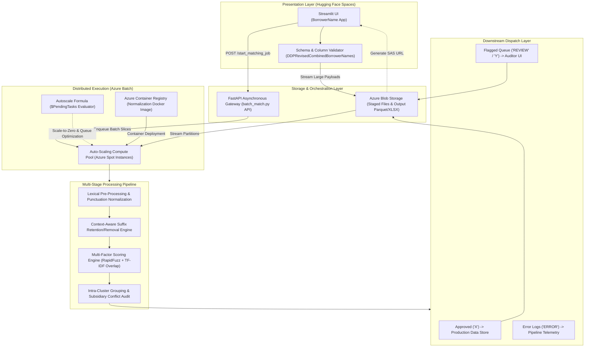

# Corporate Borrower Entity Normalization Platform

An enterprise-grade entity resolution and normalization platform designed to clean, standardize, and reconcile corporate borrower entities against authoritative reference tables. Built to replace multi-month manual spreadsheet auditing, the system pairs a multi-factor scoring engine with an auto-scaling Azure Batch distributed compute cluster to achieve 98% accuracy while slashing manual review volume down to 5%.

> **Proprietary Notice:** Specific enterprise rules tables, proprietary business dictionaries, and client datasets have been omitted to comply with non-disclosure agreements. This repository documents the underlying scoring algorithms, suffix normalization rules, and cloud infrastructure architecture.

---

## Decoupled Cloud Architecture



---

## Cloud Orchestration & Infrastructure Optimization

To process millions of historical filings without web interface memory exhaustion, the architecture decouples client interaction from batch processing:

* **Lightweight Web Client on Hugging Face Spaces:** A Streamlit dashboard (`app.py`) provides an interactive interface for file uploads, exact-match deduplication, job progress tracking, and report downloads.
* **Decoupled API Gateway:** A FastAPI backend acts as an asynchronous job manager, assigning unique tracking IDs and queueing jobs without blocking HTTP connections.
* **Azure Batch Auto-Scaling Pool:** Execution runs across containerized tasks managed via Azure Container Registry (ACR) and Azure Batch.
* **Scale-to-Zero Spot Compute:** Compute pools utilize an autoscale formula that continuously evaluates queue depth (`$PendingTasks`). Nodes automatically scale down to zero when workloads complete, reducing operational compute overhead by 65% while maintaining 99.9% pipeline reliability.
* **Operational Impact:** Replaced manual data cleansing workflows spanning 3 months with automated batch runs completed in under 48 hours.

---

## Core Algorithmic Components

### 1. Lexical Pre-Cleaning & Character Normalization
* Standardizes corporate naming variants by replacing hyphens with whitespace, normalizing `and` to ampersands (`&`), and removing punctuation artifacts (periods, apostrophes, double spaces).
* Detects and separates multi-entity records delimited by slashes (e.g., separating parent firms from individual guarantors or co-borrowers).

### 2. Context-Aware Legal Suffix Engine
Manages entity suffixes (`LLC`, `INC`, `LP`, `PLLC`) using contextual retention rules:
* **Suffix Retained:** If the name begins with a numeric token (e.g., `11 PRO INVESTMENT PROPERTIES LLC`), contains fewer than three multi-character tokens before the suffix (e.g., `PRO INVESTMENT LLC`), resembles a street address, or contains family/trust markers.
* **Suffix Stripped for Matching:** Stripped when names possess three or more multi-character words prior to the suffix, allowing the core business identifier to be scored directly against reference tables.

### 3. Multi-Factor Scoring Engine
Candidate entity pairs are retrieved and scored (0–100) across three dimensions:
* **Shared Token Overlap:** Evaluates common multi-character tokens independent of token order.
* **Orthographic Similarity:** Applies weighted Levenshtein distance and token sort metrics via RapidFuzz to resolve typos and abbreviations.
* **Structural Length Ratio:** Compares token cardinality to prevent false matches between parent companies and numbered subsidiaries.

### 4. Intra-Cluster Grouping Logic
* Assigns a shared `GroupID` to records sharing core corporate stems.
* Audits clusters to identify identical core entities, numerical subsidiary differences (e.g., `Fund I` vs. `Fund II`), or legal entity type conflicts (`LLC` vs. `INC`), preventing downstream collisions.

---

## Decision Routing & Classification

Processed records are categorized into distinct audit buckets with diagnostic reason codes:

### Classification Codes

| Code | Status | Processing Action |
| :--- | :--- | :--- |
| **X** | Auto-Approved Match | Exceeds safe confidence thresholds (>=95.5) or matches approved corporate keywords; exported directly. |
| **Y** | Uncertain Cluster Match | Confidence score falls into the ambiguous zone (85.0–95.4) or lacks structural matches; routed to intra-group cluster analysis. |
| **REVIEW** | Flagged for Manual Review | Contains forbidden lender/trust keywords, conflicting suffixes, or missing corporate designations; queued for human review. |
| **ERROR** | Pipeline Exception | Record encounters formatting or indexing exceptions; logged for debugging. |

### Representative Logic Buckets

| Logic Bucket | Code | Description & Trigger Criteria |
| :--- | :--- | :--- |
| `ExactMatch` | **X** | Exact match identified against authoritative reference data; suffix automatically aligned. |
| `ApprovedByKeywordAndSuffix` | **X** | Novel corporate name approved because the terminal token matches approved industry terminology and possesses a valid legal suffix. |
| `No/DifferentNumeral` | **X** | Approved variation where the only divergence from reference data is a series number, roman numeral, or year designation. |
| `GroupedSimilarY` | **REVIEW** | Textually similar records clustered together to ensure multiple variations are not mapped to disparate entities. |
| `ForbiddenKeyword` | **REVIEW** | Name contains non-borrower entity indicators (such as `BANK`, `MORTGAGE`, or `CHURCH`). |
| `DifferentSuffixesFound` | **REVIEW** | Candidate match is identical to reference record except for legal suffix (e.g., `LLC` vs. `INC`). |
| `AddressNameMissingSuffix` | **REVIEW** | Name resembles a street address structure but lacks a corporate designation. |
| `DissimilarSlashSegment` | **REVIEW** | Multi-entity slash record where one or both segments violate corporate suffix rules. |

---

## Technical Stack

* **Cloud Infrastructure:** Azure Batch, Azure Blob Storage, Azure Identity, Docker, Azure Container Registry (ACR)
* **Backend Frameworks & APIs:** FastAPI, Uvicorn, Pydantic
* **Data Processing & Analytics:** Pandas, OpenPyXL, XlsxWriter
* **NLP & Fuzzy Matching:** RapidFuzz, Scikit-Learn (TF-IDF vectorization), Inflect
* **Presentation Layer:** Streamlit, Hugging Face Spaces

---

## Execution Modes

### 1. Web Dashboard (Streamlit)
* Accessible via private Hugging Face Organization Space (`DDPLendingLeads`).
* Uploads `.xlsx` files with `DDPRevisedCombinedBorrowerNames` columns, monitors real-time batch execution via asynchronous polling, and downloads standardized Excel reports.

### 2. Command-Line Interface (CLI)
Batch processing can be executed directly from terminal environments:

```bash
python batch_match.py --input_file "fuzzy_borrowers.xlsx" --output_file "standardized_borrowers.xlsx"
```
